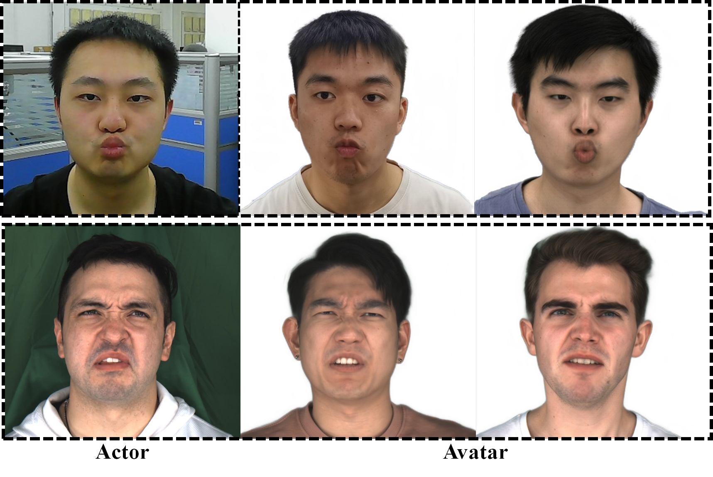

# LatentAvatar: Learning Latent Expression Code for Expressive Neural Head Avatar
## [Paper](https://arxiv.org/abs/2305.01190) | [Project Page](https://liuyebin.com/latentavatar)
 

## Getting Started
* Create a conda environment `conda env create -f environment.yml`
* Install Pytorch3d `pip install --no-index --no-cache-dir pytorch3d -f https://dl.fbaipublicfiles.com/pytorch3d/packaging/wheels/py38_cu113_pyt1120/download.html`
* Download our dataset [Google drive](https://drive.google.com/file/d/1dW4AckKW87HyKhpoHEtxsn0STgYsAMXJ/view?usp=sharing) and place `demo_dataset` in this folder
* Download [checkpoint](https://download.openmmlab.com/mmpose/face/mobilenetv2/mobilenetv2_coco_wholebody_face_256x256-4a3f096e_20210909.pth) of the landmark detector from [mmpose](https://github.com/open-mmlab/mmpose)

## Training
First, train the avatar
```
python train_avatar.py
```
Second, train the Y-shaped architecture and the mapping MLP jointly!
```
python train_yvae.py
```

## Evaluation
Self reenactment
```
python self_reenactment.py
```
Cross-identity reenactment
```
python cross_reenactment.py
```

## Citation
```
@inproceedings{xu2023latentavatar,
  title={LatentAvatar: Learning Latent Expression Code for Expressive Neural Head Avatar},
  author={Xu, Yuelang and Zhang, Hongwen and Wang, Lizhen and Zhao, Xiaochen and Huang, Han and Qi, Guojun and Liu, Yebin},
  booktitle={ACM SIGGRAPH 2023 Conference Proceedings},
  year={2023}
}

```
